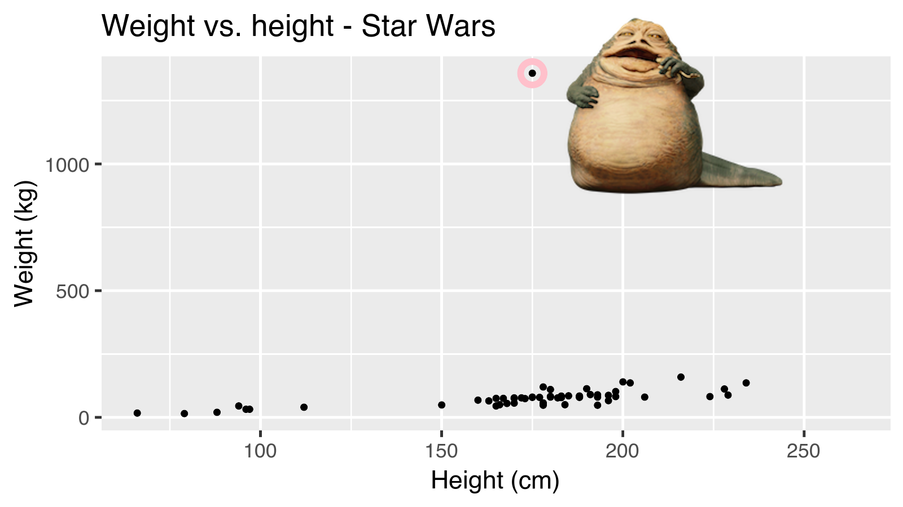

```{r child = "../setup.Rmd"}
```

```{r packages, echo=FALSE, message=FALSE, warning=FALSE}
library(tidyverse)
library(palmerpenguins)
library(magick)
```

## Análise exploratória de dados

- Análise a conjuntos de dados de forma a sumarizar e entender as suas principais características
- Muitas vezes, é mais fácil fazê-lo visualmente com gráficos (agora)
--

- Mas também pode ser necessitar de manipulação e transformação dos dados, e cálculo de estatísticas básicas (próximas sessões)

---

## Peso vs. altura

.question[ 
Qual é a relação peso vs. altura entre as personagens do Star Wars?
Haverá outras variáveis que possam ajudar a compreender esta relação?
]

```{r fig.width = 8, warning = FALSE, echo=FALSE, out.width = "50%"}
ggplot(data = starwars, mapping = aes(x = height, y = mass)) +
  geom_point() +
  labs(title = "Peso vs. altura - Star Wars",
       x = "Height (cm)", y = "Weight (kg)") +
  geom_point(data = starwars %>% filter(name == "Jabba Desilijic Tiure"), size = 5, pch = 1, color = "pink", stroke = 3)
```

---

## Jabba!

```{r echo = FALSE, warning = FALSE, cache = TRUE, out.width = "80%"}
jabba <- image_read("img/jabba.png")

fig <- image_graph(width = 1600, height = 900, res = 200)
ggplot(data = starwars, mapping = aes(x = height, y = mass)) +
  geom_point() +
  labs(title = "Peso vs. altura - Star Wars",
       x = "Height (cm)", y = "Weight (kg)") +
  geom_point(data = starwars %>% filter(name == "Jabba Desilijic Tiure"), size = 5, pch = 1, color = "pink", stroke = 3)
dev.off()

out <- fig %>% image_composite(jabba, offset = "+1000+30")

image_write(out, "img/jabbaplot.png", format = "png")

```

---

## Visualização de dados no tidyverse = **ggplot**

.pull-left[
```{r echo=FALSE, out.width="80%"}
knitr::include_graphics("img/ggplot2-part-of-tidyverse.png")
```
] 
.pull-right[ 
- `gg` = Gramática dos Gráficos ( _Grammar of Graphics_ )
- Inspirado pelo livro **Grammar of Graphics** de Leland Wilkinson
- Estrutura básica do código

````r
ggplot(data = [dataset], 
       mapping = aes(x = [x-variable], 
                     y = [y-variable])) +
   geom_xxx() +
   other options
````

]

---

## Gramática dos Gráficos

.pull-left-narrow[
Descrição geral dos vários componentes que **qualquer** gráfico tem
]
.pull-right-wide[
```{r echo=FALSE, out.width="100%"}
knitr::include_graphics("img/grammar-of-graphics.png")
```
]

.footnote[ Source: [BloggoType](http://bloggotype.blogspot.com/2016/08/holiday-notes2-grammar-of-graphics.html)]

---

## Dados: Pinguins de Palmer

Medições feitas a diferentes espécies de pinguins numa ilha do Archipelago Palmer: dimensões (barbatanas, bico, peso) e sexo.

.pull-left-narrow[
```{r echo=FALSE, out.width="80%"}
knitr::include_graphics("img/penguins.png")
```
]
.pull-right-wide[
```{r}
library(palmerpenguins)
glimpse(penguins)
```
]

---

.panelset[
.panel[.panel-name[Plot]
```{r ref.label = "penguins", echo = FALSE, warning = FALSE, out.width = "70%", fig.width = 8}
```
]
.panel[.panel-name[Code]

```{r penguins, fig.show = "hide"}
ggplot(data = penguins, 
       mapping = aes(x = bill_depth_mm, y = bill_length_mm,
                     colour = species)) +
  geom_point() +
  labs(title = "Comprimento e largura do bico",
       x = "Largura (mm)", y = "Comprimento (mm)",
       colour = "Espécie")
```
]
]

---

class: middle

# Construção de um gráfico no ggplot2

---

.midi[
> **Começamos com o data frame `penguins`**
]

.pull-left[
```{r penguins-0, fig.show = "hide", warning = FALSE}
ggplot(data = penguins) #<<
```
]
.pull-right[
```{r ref.label = "penguins-0", echo = FALSE, warning = FALSE, out.width = "100%", fig.width = 8}
```
]

---

.midi[
> Começamos com o data frame `penguins`,
> **mapeamos a largura do bico ao eixo dos x**
]

.pull-left[
```{r penguins-1, fig.show = "hide", warning = FALSE}
ggplot(data = penguins,
       mapping = aes(x = bill_depth_mm)) #<<
```
]
.pull-right[
```{r ref.label = "penguins-1", echo = FALSE, warning = FALSE, out.width = "100%", fig.width = 8}
```
]


---

.midi[
> Começamos com o data frame `penguins`,
> mapeamos a largura do bico ao eixo dos x
> **e o comprimento ao eixo dos y.**
]

.pull-left[
```{r penguins-2, fig.show = "hide", warning = FALSE}
ggplot(data = penguins,
       mapping = aes(x = bill_depth_mm,
                     y = bill_length_mm)) #<<
```
]
.pull-right[
```{r ref.label = "penguins-2", echo = FALSE, warning = FALSE, out.width = "100%", fig.width = 8}
```
]

---

.midi[
> Começamos com o data frame `penguins`,
> mapeamos a largura do bico ao eixo dos x
> e o comprimento ao eixo dos y. 
> **Representamos cada observação por um ponto**
]

.pull-left[
```{r penguins-3, fig.show = "hide", warning = FALSE}
ggplot(data = penguins,
       mapping = aes(x = bill_depth_mm,
                     y = bill_length_mm)) + 
  geom_point() #<<
```
]
.pull-right[
```{r ref.label = "penguins-3", echo = FALSE, warning = FALSE, out.width = "100%", fig.width = 8}
```
]

---

.midi[
> Começamos com o data frame `penguins`,
> mapeamos a largura do bico ao eixo dos x
> e o comprimento ao eixo dos y. 
> Representamos cada observação por um ponto
> **e mapeamos a espécie à cor dos pontos.**
]

.pull-left[
```{r penguins-4, fig.show = "hide", warning = FALSE}
ggplot(data = penguins,
       mapping = aes(x = bill_depth_mm,
                     y = bill_length_mm,
                     colour = species)) + #<<
  geom_point()
```
]
.pull-right[
```{r ref.label = "penguins-4", echo = FALSE, warning = FALSE, out.width = "100%", fig.width = 8}
```
]

---

.midi[
> Começamos com o data frame `penguins`,
> mapeamos a largura do bico ao eixo dos x
> e o comprimento ao eixo dos y. 
> Representamos cada observação por um ponto
> e mapeamos a espécie à cor dos pontos.
> **Damos um título ao gráfico,**
]

.pull-left[
```{r penguins-5, fig.show = "hide", warning = FALSE}
ggplot(data = penguins,
       mapping = aes(x = bill_depth_mm,
                     y = bill_length_mm,
                     colour = species)) +
  geom_point() +
  labs(title = "Comprimento e largura do bico") #<<
```
]
.pull-right[
```{r ref.label = "penguins-5", echo = FALSE, warning = FALSE, out.width = "100%", fig.width = 8}
```
]

---

.midi[
> Começamos com o data frame `penguins`,
> mapeamos a largura do bico ao eixo dos x
> e o comprimento ao eixo dos y. 
> Representamos cada observação por um ponto
> e mapeamos a espécie à cor dos pontos.
> Damos um título ao gráfico,
> **alteramos as legendas dos eixos**
]

.pull-left[
```{r penguins-6, fig.show = "hide", warning = FALSE}
ggplot(data = penguins,
       mapping = aes(x = bill_depth_mm,
                     y = bill_length_mm,
                     colour = species)) +
  geom_point() +
  labs(title = "Comprimento e largura do bico",
       x = "Largura (mm)", y = "Comprimento (mm)") #<<
```
]
.pull-right[
```{r ref.label = "penguins-6", echo = FALSE, warning = FALSE, out.width = "100%", fig.width = 8}
```
]


---

.midi[
> Começamos com o data frame `penguins`,
> mapeamos a largura do bico ao eixo dos x
> e o comprimento ao eixo dos y. 
> Representamos cada observação por um ponto
> e mapeamos a espécie à cor dos pontos.
> Damos um título ao gráfico,
> alteramos as legendas dos eixos **e o título da legenda das cores.**
]

.pull-left[
```{r penguins-7, fig.show = "hide", warning = FALSE}
ggplot(data = penguins,
       mapping = aes(x = bill_depth_mm,
                     y = bill_length_mm,
                     colour = species)) +
  geom_point() +
  labs(title = "Comprimento e largura do bico",
       x = "Largura (mm)", y = "Comprimento (mm)",
       colour = "Espécie") #<<
```
]
.pull-right[
```{r ref.label = "penguins-7", echo = FALSE, warning = FALSE, out.width = "100%", fig.width = 8}
```
]

---

.midi[
> Começamos com o data frame `penguins`
> mapeamos a largura do bico ao eixo dos x
> e o comprimento ao eixo dos y. 
> Representamos cada observação por um ponto
> e mapeamos a espécie à cor dos pontos.
> Damos um título ao gráfico,
> alteramos as legendas dos eixos e o título da legenda das cores.
> **Acrescentamos uma nota com a fonte dos dados.**
]

.pull-left[
```{r penguins-8, fig.show = "hide", warning = FALSE}
ggplot(data = penguins,
       mapping = aes(x = bill_depth_mm,
                     y = bill_length_mm,
                     colour = species)) +
  geom_point() +
  labs(title = "Comprimento e largura do bico",
       x = "Largura (mm)", y = "Comprimento (mm)",
       colour = "Espécie",
       caption = "Fonte: Palmer Station LTER / palmerpenguins package") #<<
```
]
.pull-right[
```{r ref.label = "penguins-8", echo = FALSE, warning = FALSE, out.width = "100%", fig.width = 8}
```
]

---

.panelset[
.panel[.panel-name[Plot]
```{r ref.label="penguins-10-nohighlight", echo = FALSE, warning = FALSE, out.width = "70%", fig.width = 8}
```
]
.panel[.panel-name[Code]

```{r penguins-10-nohighlight, fig.show = "hide"}
ggplot(data = penguins,
       mapping = aes(x = bill_depth_mm,
                     y = bill_length_mm,
                     colour = species)) +
  geom_point() +
  labs(title = "Comprimento e largura do bico",
       x = "Largura (mm)", y = "Comprimento (mm)",
       colour = "Espécie",
       caption = "Fonte: Palmer Station LTER / palmerpenguins package") 
```
]
.panel[.panel-name[Narrative]
.pull-left-wide[
.midi[
 Começamos com o data frame `penguins`,
 mapeamos a largura do bico ao eixo dos x
 e o comprimento ao eixo dos y. 
 Representamos cada observação por um ponto
 e mapeamos a espécie à cor dos pontos.
 Damos um título ao gráfico,
 alteramos as legendas dos eixos e o título da legenda das cores.
 Acrescentamos uma nota com a fonte dos dados.

]
]
]
]

---

## Dica: podemos omitir os nomes dos primeiros argumentos em ggplot

.pull-left[
```{r named-args, eval = FALSE}
ggplot(data = penguins,
       mapping = aes(x = bill_depth_mm,
                     y = bill_length_mm,
                     colour = species)) +
  geom_point() 
```
]
.pull-right[
```{r not-named-args, eval = FALSE}
ggplot(penguins,
       aes(x = bill_depth_mm,
           y = bill_length_mm,
           colour = species)) +
  geom_point() 
```
]
