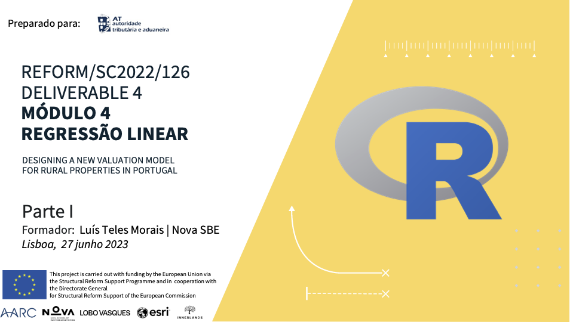

```{r child = "../setup.Rmd"}
```

```{r packages, echo = FALSE, message=FALSE, warning=FALSE}
library(tidyverse)
library(tidymodels)
library(ggpmisc)
set.seed(1234)
```
---

```{r out.width="100%", echo=FALSE}

```

---
class: middle

# O que é um **modelo**?

---

## Modelos lineares

- Usamos **modelos** para analisar a relação entre diversas variáveis (aleatórias). Objetivo: 
  - realizar previsões (através de inferência estatística)...
  - sobre aspetos da realidade desconhecidos (parâmetros)...
  - a partir de informação conhecida (amostras).
--

- Aqui vamos ater-nos aos modelos lineares, ou de **regressão linear**
- Ter presente que a realidade muitas vezes não é linear...
  - Linearidade: hipótese simplificadora


---

## Modelos lineares
  
.pull-left[
```{r echo = FALSE, out.width = "100%"}
df1 <- tibble(x = 1:100, y = x + rnorm(100, mean = 0, sd = 5))
ggplot(df1, aes(x = x, y = y)) +
  geom_point() +
  geom_smooth(method = "lm", color = "#E48957", se = FALSE) +
  labs(title = "Linear", x = NULL, y = NULL) +
  theme(
    axis.text  = element_blank(),
    axis.ticks = element_blank()
    )
```
]
.pull-right[
```{r echo = FALSE, out.width = "100%"}
df2 <- tibble(x = seq(-6, 5.9, 0.1), y = (1 / (1+exp(-2*x))) + rnorm(120, mean = 0, sd = 0.1))
ggplot(df2, aes(x = x, y = y)) +
  geom_point() +
  geom_smooth(method = "loess", color = "#8E2C90", se = FALSE) +
  labs(title = "Não-linear", x = NULL, y = NULL) +
  theme(
    axis.text  = element_blank(),
    axis.ticks = element_blank()
    )
```
]

---
class: middle

# Dados: quadros de Paris


---

## Leilões em Paris no séc. XVIII


```{r out.width="45%", echo=FALSE}
knitr::include_graphics("img/old-auction.png")
```
.small[
_Pierre-Antoine de Machy, Public Sale at the Hôtel Bullion, Musée Carnavalet, Paris (séc. XVIII)_
]

.center[**paris-paintings.xlsx**]

- Fonte: Catálogos impressos de 28 leilões de arte em Paris, 1764 - 1780
- Créditos: Sandra van Ginhoven and Hilary Coe Cronheim (U. Duke)

---

## _Départ pour la chasse_

```{r out.width="65%", echo=FALSE}
knitr::include_graphics("img/depart-pour-la-chasse.png")
```

---

## Fonte primária dos dados

.pull-left[
```{r out.width="60%", echo=FALSE}
knitr::include_graphics("img/auction-catalogue.png")
```
]
.pull-right[
.small[
Duas pinturas de composição muito rica, de bela execução, e cujo mérito é notável, cada uma com 17 polegadas e 3 linhas de altura, 23 polegadas de largura; o primeiro, pintado em madeira, provém do acervo de Madame la Comtesse de Verrue; representa uma **partida para a caça**: mostra à frente uma criança num cavalo branco, um homem que toca a corneta para reunir os cães, um falcoeiro e outras figuras bem distribuídas pela largura da pintura; dois cavalos bebendo de uma fonte; à direita, ao canto, uma bela casa de campo encimada por um terraço, onde estão pessoas à mesa, outras que tocam instrumentos; árvores e tecidos enriquecem agradavelmente o fundo.
]
]

---

```{r out.width="55%", echo=FALSE}
knitr::include_graphics("img/painting1.png")
knitr::include_graphics("img/painting2.png")
knitr::include_graphics("img/painting3.png")
```

- $>3000$ quadros, preços, e detalhes digitalizados $\rightarrow$ $>60$ variáveis


---

## Inserir slide sobre read_excel

---

## Importar os dados

- Importe os dados na folha **data** do livro Excel **paris-paintings.xlsx**:
  - Para um objeto com o nome **pp**
  - Garantindo que quaisquer destes: "n/a", "", "NA" é interpretado corretamente como valor `r NA`

- Experimente usar os menus do R primeiro...
- ... e depois usando a função **read_excel**. Qual é a forma mais rápida?

---

## Importe os dados

```{r dnload-data, message=FALSE, out.width="40%"}
pp <- readxl::read_excel("data/paris-paintings.xlsx", sheet = "data", 
               na = c("n/a", "", "NA"))

pp
```


---

class: middle

# Modelo: largura x altura?

---

## Distribuições (univariadas)

#### Altura

.small[
```{r height-dist, out.width="50%", warning=FALSE}
ggplot(data = pp, aes(x = Height_in)) +
  geom_histogram(binwidth = 5) +
  labs(x = "Polegadas", y = NULL)
```
]

---

## Distribuições marginais (univariadas)

#### Largura

.small[
```{r width-dist, out.width="50%", warning=FALSE}
ggplot(data = pp, aes(x = Width_in)) +
  geom_histogram(binwidth = 5) +
  labs(x = "Polegadas", y = NULL)
```
]

---

## Altura vs largura (multivariada)


.panelset[
.panel[.panel-name[Plot]
```{r ref.label = "height-width-plot-no-se", echo = FALSE, warning = FALSE, out.width = "60%"}
```
]
.panel[.panel-name[Code]

```{r height-width-plot-no-se, fig.show="hide", warning=FALSE}
ggplot(data = pp, aes(x = Width_in, y = Height_in)) +
  geom_point() +
  geom_smooth(method = "lm", 
              se = FALSE) + #<<
  labs(
    title = "Altura vs. largura dos quadros",
    subtitle = "Leilões de Paris, 1764 - 1780",
    x = "Largura, polegadas",
    y = "Altura, polegadas"
  )
```
]
]


---

## ... com uma medida de incerteza

.panelset[
.panel[.panel-name[Plot]
```{r ref.label = "height-width-plot", echo = FALSE, warning = FALSE, out.width = "60%"}
```
]
.panel[.panel-name[Code]

```{r height-width-plot, fig.show="hide"}
ggplot(data = pp, aes(x = Width_in, y = Height_in)) +
  geom_point() +
  geom_smooth(method = "lm") +
  labs(
    title = "Altura vs. largura dos quadros",
    subtitle = "Leilões de Paris, 1764 - 1780",
    x = "Largura, polegadas",
    y = "Altura, polegadas"
  )
```
]
]

- Intervalo de confiança
---

## Vocabulário

- **Variável dependente** ou **resposta** Variável cujo comportamento queremos entender / variabilidade queremos explicar a partir de outra(s) -- eixo **yy**

--
- **Variáveis independentes** ou **explicativas** Outras váriaveis que utilizamos para explicar o comportamento da variável dependente -- eixo **xx**

--
- **Valor estimado** ou previsto ou ajustado ($\hat{y}$): o output do **modelo**
  - O modelo dá o valor médio (ou esperado) da váriavel dependente, *condicional*, i.e. para um determinado valor, da variável independente
  
--
- **Resíduo**: Mede a distância entre um valor observado (numa amostra) e o valor estimado (com base num determinado modelo)
  - Resíduo = Valor observado - Valor estimado
  - Indica quão próximo está o modelo de "acertar" num determinado ponto dos dados, ou por outra, por quanto é que o modelo "falha"

---

## Resíduos

.panelset[
.panel[.panel-name[Plot]
```{r ref.label = "height-width-plot-residuals", echo = FALSE, warning = FALSE, out.width = "60%"}
```
]
.panel[.panel-name[Code]
.small[
```{r height-width-plot-residuals, fig.show="hide", warning=FALSE}
ht_wt_fit <- linear_reg() %>%
  set_engine("lm") %>%
  fit(Height_in ~ Width_in, data = pp)

ht_wt_fit_tidy <- tidy(ht_wt_fit$fit) 
ht_wt_fit_aug  <- augment(ht_wt_fit$fit) %>%
  mutate(res_cat = ifelse(.resid > 0, TRUE, FALSE))

ggplot(data = ht_wt_fit_aug) +
  geom_point(aes(x = Width_in, y = Height_in, color = res_cat)) +
  geom_line(aes(x = Width_in, y = .fitted), size = 0.75, color = "#8E2C90") + 
  labs(
    title = "Height vs. width of paintings",
    subtitle = "Paris auctions, 1764 - 1780",
    x = "Width (inches)",
    y = "Height (inches)"
  ) +
  guides(color = "none") +
  scale_color_manual(values = c("#260b27", "#e6b0e7")) +
  geom_text(aes(x = 0, y = 150), label = "Positive residual", color = "#e6b0e7", hjust = 0, size = 8) +
  geom_text(aes(x = 150, y = 25), label = "Negative residual", color = "#260b27", hjust = 0, size = 8)
```
]
]
]

---

.question[
- O que mudou no gráfico?
- Que padrão nos dados se tornou agora aparente?
- O que pode significar, em termos estatísticos? E na realidade?
]

```{r height-width-plot-alpha, warning = FALSE, echo=FALSE, out.width="55%"}
ggplot(data = pp, aes(x = Width_in, y = Height_in)) +
  geom_point(alpha = 0.2) +
  labs(
    title = "Height vs. width of paintings",
    subtitle = "Paris auctions, 1764 - 1780",
    x = "Width (inches)",
    y = "Height (inches)"
  )
```

---

## Paisagens vs. retratos

- A pintura de paisagem é a representação de paisagens - cenários naturais como montanhas, vales, árvores, rios e florestas
composição
   - Habitualmente, largura $>$ altura
- Na pintura de retratos a intenção é retratar um sujeito humano:
   - Habitualmente, largura $<$ altura
   
---

## Modelos, oportunidades e riscos

- **Oportunidade**: os modelos estatísticos podem revelar padrões que não se conseguem desvelar num gráfico 
  - sobretudo em modelos de regressão múltipla, i.e. com diversas variáveis explicativas em simultâneo (próxima aula)
  


.pull-left[
```{r width-plot-alpha, warning = FALSE, echo=FALSE, out.width="90%"}
ggplot(data = pp %>% select(Width_in,Height_in, landsALL) %>% pivot_longer(c('Width_in','Height_in')) %>% filter(landsALL == 0)
       ) +
  geom_histogram(aes(x = value, fill = name),alpha = 0.6, position = 'identity') +
  labs(
    title = "Retratos",
    x = "Polegadas",
    y = "n"
  ) + theme(legend.position = 'bottom')
```
]
.pull-right[   
```{r hhheight-plot-alpha, warning = FALSE, echo=FALSE, out.width="90%"}
ggplot(data = pp %>% select(Width_in,Height_in, landsALL) %>% pivot_longer(c('Width_in','Height_in')) %>% filter(landsALL == 1)
       ) +
  geom_histogram(aes(x = value, fill = name), alpha = 0.6, position = 'identity') +
  labs(
    title = "Paisagens",
    x = "Polegadas",
    y = "n"
  ) + theme(legend.position = 'bottom')
```
]

---

## Modelos, oportunidades e riscos

- **Risco**: um modelo pode indicar que os dados têm uma determinada estrutura (uma  distribuição) que não corresponde à realidade -- regressão espúria

.pull-left[
```{r ursa-plot-no-se,  warning=FALSE, echo = F, out.width="80%"}
ggplot(data = pp, aes(x = Width_in, y = logprice)) + xlim(0,150) +
  geom_point() +
  geom_smooth(method = "lm", 
              se = FALSE) + #<<
  labs(
    title = "Altura vs. largura dos quadros",
    subtitle = "Leilões de Paris, 1764 - 1780",
    x = "Largura, polegadas",
    y = "Altura, polegadas"
  )
```
]

--

.pull-right[
```{r out.width="80%", echo=FALSE}
knitr::include_graphics("img/ursa-major-.jpg")
```
]
